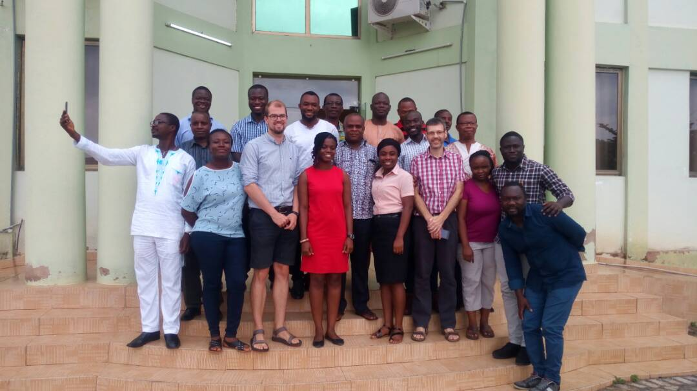

# African-SWIFT Python training

This repository contains training materials (and example answers) used during
the June 2018 training course carried out at GSSTI (Ghana Space Science
& Technology Institute) in Ghana as part of the African-SWIFT project.

The exercises focussed on teaching `numpy`, `scipy`, `matplotlib`, `cartopy`
and `xarray`.

- [fundamentals/](fundamentals/): fundamentals in python-based data-analysis,
  based off [Michael Zingale's
  exercises](http://bender.astro.sunysb.edu/classes/python-science/).

- [cases/2006_07_31](cases/2006_07_31): Reproducing analysis and figures from
  Birch et al 2013 which studied a Mesoscale Convective System on and around
  31st June 2006.

- [participant-examples/](participant-examples/): examples based on problems
  and questions from participants at the workshop. Includes examples of using
  Kriging, working with CSV files, regridding and working with BUFR files.

- [gssti-hpc/](gstti-hpc): examples of what can be done with Python by: 1)
  visualising which PCs are turned on and 2) whether there is internet access

If you spot any mistakes, have any questions or suggestions please [raise an
issue](https://github.com/leifdenby/swift-python-training-2018/issues/new).
